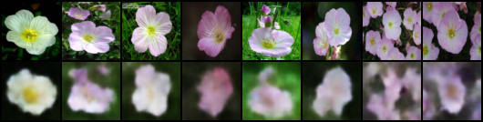
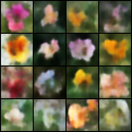
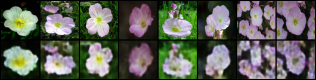
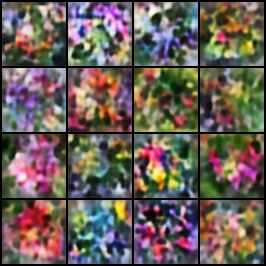
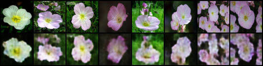
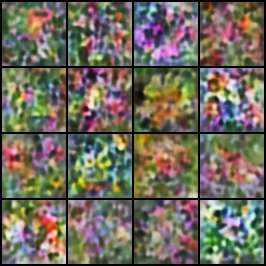

# From-Scratch Conditional VAE for Flower Image Generation

## Overview

This project implements a Variational Autoencoder (VAE) and Conditional Variational Autoencoder (CVAE) completely from scratch in PyTorch for flower image generation using the Oxford 102 Flowers dataset.

The project explores:
- image reconstruction
- random image generation
- conditional image generation
- latent space interpolation
- KL annealing
- hyperparameter tuning

The goal is not photorealism, but understanding and implementing generative modeling pipelines from scratch.

---

## Dataset

Oxford 102 Flowers Dataset

Dataset structure:

```text
flower_dataset/
└── dataset/
    ├── train/
    ├── valid/
    └── test/
````

Each subfolder contains flower class folders and corresponding flower images.

---

## Installation

Create environment:

```bash
conda create -n genai_env python=3.12
conda activate genai_env
```

Install dependencies:

```bash
pip install torch torchvision matplotlib numpy pillow
```

---

## Project Structure

```text
GenAI/
├── models/
│   ├── vae.py
│   └── cvae.py
│
├── train.py
├── sample.py
├── utils.py
│
├── flower_dataset/
│
└── outputs/
```

---

## Training

### Baseline VAE

```bash
python train.py \
  --data_dir ./flower_dataset/dataset \
  --exp_name exp_baseline_vae_beta1_latent64 \
  --epochs 100 \
  --batch_size 32 \
  --lr 1e-3 \
  --latent_dim 64 \
  --beta 1.0 \
  --recon_loss_type mse \
  --patience 15
```

---

### Improved VAE

```bash
python train.py \
  --data_dir ./flower_dataset/dataset \
  --exp_name exp_vae_beta005_latent256 \
  --epochs 150 \
  --batch_size 32 \
  --lr 1e-4 \
  --latent_dim 256 \
  --beta 0.05 \
  --recon_loss_type mse \
  --patience 20 \
  --kl_annealing
```

---

### Optimized CVAE

```bash
python train.py \
  --data_dir ./flower_dataset/dataset \
  --exp_name exp_cvae_beta001_latent256_emb128 \
  --conditional \
  --epochs 150 \
  --batch_size 32 \
  --lr 1e-4 \
  --latent_dim 256 \
  --label_emb_dim 128 \
  --beta 0.01 \
  --recon_loss_type mse \
  --patience 20 \
  --kl_annealing
```

---

## Sampling

### Generate Images

```bash
python sample.py \
  --ckpt_path ./outputs/exp_cvae_beta001_latent256_emb128/checkpoints/best_model.pth \
  --exp_name exp_cvae_final \
  --conditional \
  --num_classes 102 \
  --latent_dim 256 \
  --label_emb_dim 128 \
  --class_id 0
```

Generated images are saved under:

```text
outputs/<experiment_name>/generated/
```

---

## Results

### Baseline VAE Reconstruction



### Baseline VAE Samples



---

### Improved VAE Reconstruction



### Improved VAE Samples



---

### Optimized CVAE Reconstruction



### Optimized CVAE Samples



---

## Extra Criteria Pursued

This project includes several advanced components beyond the baseline requirements:

* Hyperparameter tuning

  * latent dimension
  * beta values
  * learning rates
  * label embedding size

* KL annealing

* Latent space interpolation

* Experiment tracking

  * separate experiment folders
  * CSV logging
  * checkpoint management

* Conditional image generation (CVAE)

* Early stopping

---

## Difficulties & Solutions

### Difficulty 1: Blurry Reconstructions

The baseline VAE produced blurry flower images due to strong KL regularization and limited latent capacity.

### Solution

I improved reconstruction quality by:

* increasing latent dimension
* lowering beta values
* adding KL annealing
* using larger label embeddings for CVAE

These changes significantly improved image sharpness and latent representation quality.

---

### Difficulty 2: Conditional Generation with Fine-Grained Flower Classes

The Oxford 102 Flowers dataset contains many visually similar flower categories, making conditional generation challenging.

### Solution

I increased the label embedding dimension and tuned the conditional VAE hyperparameters to strengthen the conditioning signal.

---

## Key Takeaways

* Standard VAE training often produces blurry images due to reconstruction averaging.
* Lower beta values improve reconstruction quality by reducing latent regularization strength.
* KL annealing stabilizes VAE training.
* CVAE conditioning becomes more difficult for fine-grained image categories.

